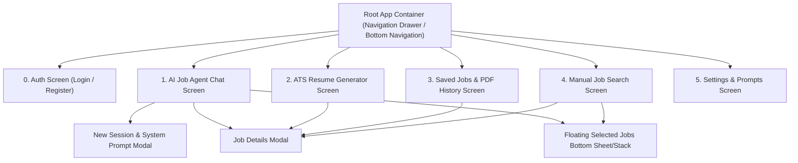

# Complete API & UI Architecture Documentation for Mobile/Android Migration

This document details the entire API contract, UI hierarchy, real-time WebSocket protocol, and data flows of the Resume Generator & AI Job Finder system to enable direct Android application development.

---

## 1. Application Page Hierarchy & Screen Flow



### Global Shared States
- **Selected Jobs Stack (`selectedJobs`)**: A global list of selected Job IDs (`string[]`) accessible across screens, displayed in a persistent floating badge/drawer at the bottom right.
- **Active Session ID (`activeSessionId`)**: Currently active agent chat session.
- **API Base URL (`API_BASE_URL`)**: `http://<server-ip>:8000` (Local/Server Host)
- **Centrifugo WS URL**: `ws://<server-ip>:8008/connection/websocket`

---

## 2. API Endpoint Specification Categorized by Page

### Page 0: Authentication Screen (`AuthPage.tsx`)

#### 1. Register User
- **Endpoint**: `POST /api/auth/register`
- **Request Body**:
  ```json
  {
    "email": "user@example.com",
    "password": "securepassword",
    "full_name": "Bilal Developer"
  }
  ```
- **Response** (`200 OK`):
  ```json
  {
    "id": 1,
    "email": "user@example.com",
    "full_name": "Bilal Developer",
    "created_at": "2026-09-30T07:00:00Z"
  }
  ```
- **Android Usage**: Submit registration form data.

#### 2. User Login
- **Endpoint**: `POST /api/auth/login`
- **Request Body**:
  ```json
  {
    "email": "user@example.com",
    "password": "securepassword"
  }
  ```
- **Response** (`200 OK`):
  ```json
  {
    "access_token": "eyJhbGciOi...",
    "token_type": "bearer",
    "user": {
      "id": 1,
      "email": "user@example.com",
      "name": "Bilal Developer"
    }
  }
  ```
- **Android Usage**: Authenticates user, stores JWT in EncryptedSharedPreferences / DataStore.

---

### Page 1: AI Job Search Agent Chat (`ChatPage.tsx`)

#### 1. Fetch All Active Agent Chat Sessions
- **Endpoint**: `GET /api/linkedin/agent/sessions`
- **Response** (`200 OK`):
  ```json
  {
    "count": 2,
    "sessions": [
      {
        "session_id": "job_agent_session_01",
        "title": "Python Remote Job Search",
        "system_prompt": "You are a Job Finder Consultant...",
        "last_activity": "2026-09-30T08:30:00Z",
        "message_count": 5
      }
    ]
  }
  ```
- **Android Usage**: Populates the Sessions Drawer / Sidebar.

#### 2. Create New Agent Chat Session
- **Endpoint**: `POST /api/linkedin/agent/session/create` (or `POST /api/linkedin/agent/session`)
- **Request Body**:
  ```json
  {
    "session_id": "session_1790755005742", // Optional
    "title": "Senior AI Role Search",      // Optional
    "system_prompt": "Custom prompt text..." // Optional (Overrides default)
  }
  ```
- **Response** (`200 OK`):
  ```json
  {
    "status": "success",
    "session_id": "session_1790755005742",
    "title": "Senior AI Role Search",
    "system_prompt": "Custom prompt text..."
  }
  ```
- **Android Usage**: Triggered by New Session Modal.

#### 3. Fetch Session Message & Delta Event History
- **Endpoint**: `GET /api/linkedin/agent/history/{session_id}`
- **Response** (`200 OK`):
  ```json
  {
    "session_id": "job_agent_session_01",
    "count": 4,
    "messages": [
      {
        "id": 1,
        "role": "user",
        "content": "Find Python Remote jobs",
        "token_count": 12,
        "created_at": "2026-09-30T08:30:00Z"
      },
      {
        "id": 2,
        "role": "assistant",
        "content": "Awaiting User selection",
        "token_count": 4,
        "created_at": "2026-09-30T08:30:05Z"
      }
    ],
    "events": [
      {
        "timestamp": "2026-09-30T08:30:02Z",
        "event_type": "thinking",
        "data": { "text": "Searching LinkedIn jobs for Python Remote..." }
      }
    ],
    "cached_jobs": [
      { "job_id": "4123456789", "job_title": "Senior Python Engineer" }
    ],
    "job_ids": ["4123456789"]
  }
  ```
- **Android Usage**: Restores complete conversation messages and execution traces when switching chat tabs.

#### 4. Send Message to Agent
- **Endpoint**: `POST /api/linkedin/agent/chat`
- **Request Body**:
  ```json
  {
    "session_id": "job_agent_session_01",
    "message": "Search Python Remote jobs at Deloitte and Accenture"
  }
  ```
- **Response** (`200 OK`):
  ```json
  {
    "session_id": "job_agent_session_01",
    "response": "Awaiting User selection",
    "job_ids": ["4123456789", "4987654321"],
    "token_usage": {
      "prompt_tokens": 450,
      "completion_tokens": 120,
      "total_tokens": 570
    }
  }
  ```
- **Android Usage**: Sends user prompt to ReAct agent. Live step updates are received simultaneously over Centrifugo WebSocket.

#### 5. Rename Chat Session Title
- **Endpoint**: `PUT /api/linkedin/agent/session/{session_id}/title`
- **Request Body**:
  ```json
  {
    "title": "Python & AI Senior Roles"
  }
  ```
- **Response** (`200 OK`):
  ```json
  {
    "status": "success",
    "session_id": "job_agent_session_01",
    "title": "Python & AI Senior Roles"
  }
  ```

#### 6. Delete Chat Session
- **Endpoint**: `DELETE /api/linkedin/agent/session/{session_id}`
- **Response** (`200 OK`):
  ```json
  {
    "status": "success",
    "session_id": "job_agent_session_01"
  }
  ```

#### 7. Centrifugo WebSocket Token Generation
- **Endpoint**: `GET /api/linkedin/centrifugo/token?user_id=user_demo`
- **Response** (`200 OK`):
  ```json
  {
    "user_id": "user_demo",
    "token": "eyJhbGciOiJIUzI1Ni...",
    "ws_url": "ws://localhost:8008/connection/websocket"
  }
  ```
- **Android Usage**: Provides JWT to establish WebSocket connection and subscribe to channel `agent:{session_id}`.

---

### Page 2: ATS Resume Generator & Optimization (`WorkflowPage.tsx`)

#### 1. Generate ATS Optimized Resume PDF
- **Endpoint**: `POST /api/workflow/generate-ats-pdf`
- **Request Body**:
  ```json
  {
    "job_id": "4123456789",
    "template_name": "modern_purple",
    "profile_id": 1, // Optional if user_data provided
    "user_data": {
      "personal_details": {
        "name": "Bilal Applicant",
        "title": "Senior AI Engineer",
        "email": "bilal@example.com"
      },
      "experience": [...],
      "skills": [...]
    },
    "save_profile": false,
    "custom_filename": "Bilal_Senior_AI_Resume",
    "agent_notes": "Emphasize Playwright and LlamaIndex experience"
  }
  ```
- **Response** (`200 OK`):
  ```json
  {
    "status": "success",
    "pdf_url": "http://localhost:8000/output/finalized_resumes/Bilal_Senior_AI_Resume.pdf",
    "relative_pdf_path": "/output/finalized_resumes/Bilal_Senior_AI_Resume.pdf",
    "template_used": "modern_purple",
    "job_id": "4123456789",
    "ats_score": 88.5,
    "analysis": {
      "section_scores": {
        "skills_match": 90,
        "experience_relevance": 85,
        "formatting": 95
      },
      "matched_skills": ["Python", "FastAPI", "React", "SQLAlchemy"],
      "missing_skills": ["Kubernetes"],
      "recommendations": ["Highlight cloud deployment experience."]
    }
  }
  ```
- **Android Usage**: Primary resume generation action. Opens/downloads generated PDF using PDF WebViewer / Intent.

#### 2. Fetch Available Resume Templates
- **Endpoint**: `GET /api/workflow/templates`
- **Response** (`200 OK`):
  ```json
  {
    "templates": [
      {
        "id": "modern_purple",
        "name": "Modern Purple Elegance",
        "description": "Sleek dark header with vibrant purple accents."
      },
      {
        "id": "executive_clean",
        "name": "Executive Minimalist",
        "description": "Clean, high-contrast monochrome design."
      }
    ]
  }
  ```

#### 3. Fetch Candidate Profiles Dropdown
- **Endpoint**: `GET /api/workflow/profiles`
- **Response** (`200 OK`):
  ```json
  {
    "profiles": [
      {
        "id": 1,
        "profile_name": "Senior AI Candidate Profile",
        "user_data": "{\"personal_details\": ...}"
      }
    ]
  }
  ```

---

### Page 3: Saved Jobs & PDF History (`SavedJobsPage.tsx`)

#### 1. Fetch All Scraped/Saved Jobs
- **Endpoint**: `GET /api/linkedin/jobs/saved`
- **Response** (`200 OK`):
  ```json
  {
    "count": 15,
    "jobs": [
      {
        "job_id": "4123456789",
        "title": "Senior AI Engineer",
        "company_name": "Deloitte",
        "location": "Hyderabad, India (Remote)",
        "posted_time": "1 day ago",
        "seniority_level": "Mid-Senior level",
        "skills_required": ["Python", "FastAPI", "PyTorch"],
        "job_url": "https://www.linkedin.com/jobs/view/4123456789"
      }
    ]
  }
  ```
- **Android Usage**: Populates the Saved Jobs list view with search, location filtering, and direct "View on LinkedIn" external links.

#### 2. Fetch Generated PDF History
- **Endpoint**: `GET /api/workflow/history`
- **Response** (`200 OK`):
  ```json
  {
    "count": 3,
    "history": [
      {
        "id": 1,
        "pdf_url": "http://localhost:8000/output/finalized_resumes/Bilal_Resume.pdf",
        "job_id": "4123456789",
        "job_title": "Senior AI Engineer",
        "template_used": "modern_purple",
        "ats_score": 88.5,
        "created_at": "2026-09-30T09:00:00Z"
      }
    ]
  }
  ```

#### 3. Fetch Full Job Description & Details Modal
- **Endpoint**: `GET /api/linkedin/job/{job_id}` (or `/jobs/details/{job_id}`)
- **Response** (`200 OK`):
  ```json
  {
    "job_id": "4123456789",
    "title": "Senior AI Engineer",
    "company_name": "Deloitte",
    "location": "Remote",
    "posted_time": "1 day ago",
    "num_applicants": "Over 100 applicants",
    "seniority_level": "Mid-Senior level",
    "employment_type": "Full-time",
    "job_function": "Engineering",
    "job_url": "https://www.linkedin.com/jobs/view/4123456789",
    "minimal_description": "We are looking for an AI Engineer...",
    "raw_description": "<p>Complete HTML/Text description...</p>",
    "skills_required": ["Python", "FastAPI", "LlamaIndex", "Docker"]
  }
  ```
- **Android Usage**: Displays full job description inside `JobModal` bottom sheet / dialog with "Add to Selected Stack" action.

---

### Page 4: User Profile & System Prompts (`ProfilePage.tsx`)

#### 1. Fetch All System Prompts
- **Endpoint**: `GET /api/linkedin/system-prompts`
- **Response** (`200 OK`):
  ```json
  {
    "count": 2,
    "prompts": [
      {
        "id": 1,
        "name": "Default Job Finder Consultant",
        "prompt_text": "You are a Job Finder Consultant expert agent...",
        "is_default": true,
        "created_at": "2026-09-30T07:00:00Z"
      }
    ]
  }
  ```

#### 2. Create System Prompt
- **Endpoint**: `POST /api/linkedin/system-prompts`
- **Request Body**:
  ```json
  {
    "name": "MNC Tech Recruiter Agent",
    "prompt_text": "Target top MNC companies like Deloitte, Accenture...",
    "is_default": false
  }
  ```

#### 3. Update System Prompt
- **Endpoint**: `PUT /api/linkedin/system-prompts/{prompt_id}`
- **Request Body**:
  ```json
  {
    "name": "Updated System Prompt Name",
    "prompt_text": "Updated instructions...",
    "is_default": true
  }
  ```

#### 4. Delete System Prompt
- **Endpoint**: `DELETE /api/linkedin/system-prompts/{prompt_id}`

#### 5. Set Active Default System Prompt
- **Endpoint**: `POST /api/linkedin/system-prompts/{prompt_id}/set-default`

#### 6. Candidate Profile CRUD
- `GET /api/workflow/profiles`: Get list of candidate profiles.
- `POST /api/workflow/profiles`: Create candidate profile JSON.
- `PUT /api/workflow/profiles/{id}`: Update candidate profile.
- `DELETE /api/workflow/profiles/{id}`: Delete candidate profile.

---

## 3. Real-Time Streaming Architecture (Centrifugo WebSockets)

### Connection Protocol
1. Fetch connection JWT via `GET /api/linkedin/centrifugo/token?user_id=user_demo`.
2. Connect WebSocket to `ws://<server-ip>:8008/connection/websocket`.
3. Subscribe to channel `agent:{session_id}`.

### Event Payload Schema
```json
{
  "timestamp": "2026-09-30T08:35:10.123Z",
  "session_id": "job_agent_session_01",
  "event_type": "thinking | action | observation | answering | token_utilization | hitl_prompt | completed",
  "data": {
    "text": "Analyzing query and formulating search parameters...",
    "tool_name": "search_linkedin_jobs",
    "job_ids": ["4123456789", "4987654321"],
    "prompt_tokens": 320,
    "completion_tokens": 85,
    "total_tokens": 405
  }
}
```

---

## 4. Android App Implementation Architecture Guidelines

### Recommended Tech Stack (Android Native)
- **Language**: Kotlin
- **UI Framework**: Jetpack Compose
- **Architecture Pattern**: MVVM / Clean Architecture (View -> ViewModel -> Repository -> Remote Data Source)
- **Networking**: Retrofit2 + OkHttp3 + Kotlin Serialization / Gson
- **WebSockets**: OkHttp WebSocket or Centrifugo Java/Kotlin Client (`io.github.centrifugal:centrifuge-java`)
- **Local Persistence**: Room Database / DataStore (for caching selected jobs & session draft messages)
- **PDF Viewer**: Android `PdfRenderer` or `Android-PdfViewer` view component.

---

## 5. Token Calculation Formula

In prompt editors and system prompt managers:
- **Token Estimation Formula**: `Math.ceil(prompt_text.length / 3)`
- **Calculation Rule**: 3 characters per token approximation.
